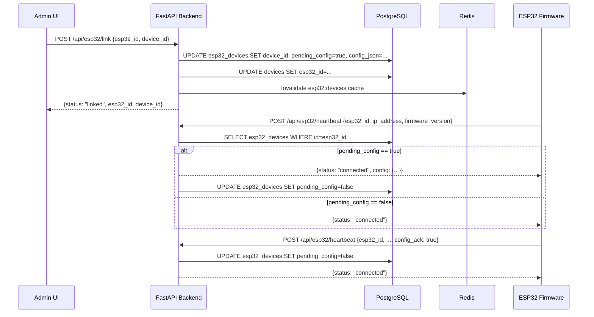
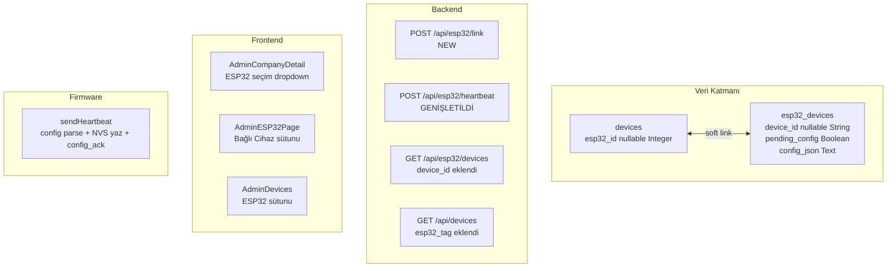

# Tasarım Belgesi — ESP32 ↔ Cihaz Eşleştirme ve Yapılandırma Gönderimi

## Genel Bakış

Bu tasarım, mevcut OFK-SCADA sistemine **dokunmadan** ESP32 ↔ Device çift yönlü bağlantısını ve yapılandırma iletim mekanizmasını ekler. Dört katmanda değişiklik yapılır:

1. **Veri katmanı** — `devices` tablosuna `esp32_id` kolonu; `esp32_devices` tablosuna `device_id`, `pending_config`, `config_json` kolonları.
2. **Backend katmanı** — Yeni `POST /api/esp32/link` endpointi; mevcut `POST /api/esp32/heartbeat` yanıtının Config_Payload taşıyacak şekilde genişletilmesi; `GET /api/esp32/devices` yanıtına `device_id` eklenmesi; `GET /api/devices` yanıtına `esp32_tag` eklenmesi.
3. **Frontend katmanı** — Cihaz ekleme formuna ESP32 seçim adımı; AdminESP32Page tablosuna "Bağlı Cihaz" sütunu; AdminDevices tablosuna "ESP32" sütunu.
4. **Firmware katmanı** — `sendHeartbeat()` fonksiyonunun config alanını ayrıştırması, NVS'e yazması ve `config_ack` göndermesi.

Mevcut modeller, route'lar ve UI bileşenleri **değiştirilmez**; yalnızca yeni alanlar ve yeni dosyalar eklenir.

---

## Mimari





---

## Bileşenler ve Arayüzler

### Backend Bileşenleri

#### `backend/app/models.py` — Mevcut Modellere Yeni Alanlar

`Device` modeline ekleme (diğer alanlar değişmez):

```python
class Device(Base):
    # ... mevcut alanlar ...
    esp32_id = Column(Integer, nullable=True)  # soft link → esp32_devices.id
```

`ESP32Device` modeline ekleme (diğer alanlar değişmez):

```python
class ESP32Device(Base):
    # ... mevcut alanlar ...
    device_id      = Column(String(20), nullable=True)   # soft link → devices.id
    pending_config = Column(Boolean, default=False)
    config_json    = Column(Text, nullable=True)
```

#### `backend/app/schemas.py` — Yeni Şemalar (Ekleme)

```python
class ESP32LinkRequest(BaseModel):
    esp32_id:  int
    device_id: str

class ESP32LinkResponse(BaseModel):
    status:    str   # "linked"
    esp32_id:  int
    device_id: str

class ESP32HeartbeatRequest(BaseModel):
    # Mevcut alanlar korunur
    esp32_id:         int
    ip_address:       Optional[str] = None
    firmware_version: Optional[str] = None
    config_ack:       Optional[bool] = False  # YENİ — config alındı bildirimi
```

Heartbeat yanıtı dinamik içerik taşıdığından `dict` olarak döner; schema annotation opsiyonel.

#### `backend/app/routes/esp32_routes.py` — Yeni ve Güncellenen Endpointler

**Yeni endpoint: `POST /api/esp32/link`**

```python
@router.post("/esp32/link", response_model=ESP32LinkResponse)
async def link_esp32_to_device(body: ESP32LinkRequest, db: AsyncSession = Depends(get_db)):
    """
    1. esp32_id ve device_id'yi doğrula (404 yoksa)
    2. Eski bağlantıyı kaldır: eski Device.esp32_id = null
    3. Yeni bağlantıyı kur:
       ESP32Device.device_id = device_id
       ESP32Device.pending_config = True
       ESP32Device.config_json = serialize(Config_Payload)
       Device.esp32_id = esp32_id
    4. Cache'i geçersiz kıl
    5. {status: "linked", ...} döndür
    """
```

**Config_Payload oluşturma yardımcı fonksiyonu:**

```python
def build_config_payload(device: Device) -> dict:
    return {
        "device_id":   device.id,
        "device_type": device.device_type,
        "subtype":     device.subtype,
        "modbus_config": device.modbus_config,
        "plc_io_config": device.plc_io_config,
    }
```

**Güncellenen endpoint: `POST /api/esp32/heartbeat`**

```python
@router.post("/esp32/heartbeat")
async def heartbeat_esp32(body: ESP32HeartbeatRequest, db: AsyncSession = Depends(get_db)):
    """
    Mevcut davranış korunur (last_seen, ip_address, firmware_version güncelleme).
    Ek davranış:
    - body.config_ack == True → pending_config = False
    - pending_config == True → yanıta config ekle, pending_config = False
    """
    # ... mevcut kod ...
    response = {"status": status}
    if device.pending_config and not body.config_ack:
        response["config"] = json.loads(device.config_json) if device.config_json else None
        device.pending_config = False
    elif body.config_ack:
        device.pending_config = False
    return response
```

**Güncellenen endpoint: `GET /api/esp32/devices`**

Yanıttaki her kayda `device_id` alanı eklenir:

```python
data.append({
    # ... mevcut alanlar ...
    "device_id": d.device_id,  # YENİ
})
```

**Güncellenen endpoint: `GET /api/devices`**

`Device` kaydına bağlı `ESP32Device` varsa `esp32_tag` eklenir. Bu endpoint `device_routes.py`'de bulunur; JOIN veya subquery ile `esp32_tag` alanı yanıta eklenir.

---

### Frontend Bileşenleri

#### `src/features/esp32/esp32Store.js` — Yeni Action

```javascript
// Mevcut fetchDevices() korunur
linkDevice: async (esp32Id, deviceId) => {
    // POST /api/esp32/link
    // Başarı → fetchDevices() yenile
    // Hata → error state'e yaz
}
```

#### `src/pages/Admin/AdminCompanyDetail.jsx` — Cihaz Ekleme Modalı Güncellemesi

Cihaz ekleme ve düzenleme modallarına "Bağlı ESP32 Seç" dropdown'ı eklenir:

```
Görünürlük koşulu: devForm.deviceType seçildikten sonra görünür
Veri kaynağı: useEsp32Store().devices filtresi → status === 'connected'
Seçenek formatı: "{esp32_tag} — {model}" (key: device.id)
Varsayılan: boş seçim (opsiyonel)
```

Form submit akışı (cihaz ekleme):

```
1. addDevice() çağır → yeni device.id al
2. selectedEsp32Id != null ise → linkDevice(selectedEsp32Id, newDeviceId)
3. Hata varsa → devError state'e yaz (cihaz silinmez)
4. Modal'ı kapat
```

#### `src/pages/Admin/ESP32DeviceTable.jsx` — Yeni Sütun

Mevcut sütunlara "Bağlı Cihaz" sütunu eklenir:

```javascript
// Sütun başlığı dizisine 'Bağlı Cihaz' eklenir (Son Görülme'den önce)
// Hücre render:
device.device_id
  ? <span className="font-mono text-xs bg-blue-50 text-blue-700 px-2 py-0.5 rounded">{device.device_id}</span>
  : <span className="text-gray-300">—</span>
```

#### `src/pages/Admin/AdminDevices.jsx` — Yeni Sütun

Mevcut tabloya "ESP32" sütunu eklenir:

```javascript
// Sütun: 'ESP32'
// Hücre render:
d.esp32_tag
  ? <span className="text-xs text-indigo-600 font-medium">{d.esp32_tag}</span>
  : <span className="text-gray-300">—</span>
```

---

### Firmware Bileşenleri

#### `firmware/esp32_scada/esp32_scada.ino` — `sendHeartbeat()` Güncellemesi

Yeni global değişkenler:

```cpp
String  g_deviceId     = "";   // NVS'den yüklenir
bool    g_sendConfigAck = false; // bir sonraki heartbeat'e config_ack ekle
```

NVS yükleme/kaydetme fonksiyonları güncellenir:

```cpp
// loadFromNVS()
g_deviceId = prefs.getString("device_id", "");

// saveToNVS() / saveDeviceIdToNVS(String id)
prefs.putString("device_id", id);
```

`sendHeartbeat()` güncellemesi:

```cpp
void sendHeartbeat() {
    // ... mevcut istek oluşturma ...
    if (g_sendConfigAck) {
        doc["config_ack"] = true;
        g_sendConfigAck = false;   // sadece bir kez gönder
    }
    // ... HTTP POST ...

    if (httpCode == HTTP_CODE_OK) {
        // ... mevcut status parse ...
        // YENİ: config alanı kontrolü
        if (!resp["config"].isNull()) {
            JsonObject cfg = resp["config"].as<JsonObject>();
            // Serial'e yaz
            String cfgStr;
            serializeJsonPretty(cfg, cfgStr);
            Serial.println("[Config] Yeni yapilandirma alindi:");
            Serial.println(cfgStr);
            // device_id NVS'e kaydet
            const char* did = cfg["device_id"] | "";
            if (strlen(did) > 0) {
                saveDeviceIdToNVS(String(did));
                Serial.printf("[Config] device_id=%s NVS'e kaydedildi.\n", did);
            }
            g_sendConfigAck = true;   // bir sonraki heartbeat'e ACK ekle
        }
    }
    // ... 404 ve hata yönetimi mevcut kod ...
}
```

---

## Veri Modelleri

### `devices` Tablosu — Yeni Kolon

| Kolon | Tip | Kısıt | Açıklama |
|---|---|---|---|
| `esp32_id` | INTEGER | NULLABLE | Bağlı ESP32 cihazın ID'si (soft link) |

### `esp32_devices` Tablosu — Yeni Kolonlar

| Kolon | Tip | Kısıt | Açıklama |
|---|---|---|---|
| `device_id` | VARCHAR(20) | NULLABLE | Bağlı Device kaydının ID'si (soft link) |
| `pending_config` | BOOLEAN | DEFAULT false | Heartbeat'te gönderilecek config var mı |
| `config_json` | TEXT | NULLABLE | JSON string — Config_Payload |

### Config_Payload Şeması

```json
{
  "device_id":   "DEV-001",
  "device_type": "plc",
  "subtype":     "dvp_ss2",
  "modbus_config": {
    "slaveId":  1,
    "baudRate": 9600,
    "dataBits": 8,
    "stopBits": 1,
    "parity":   "none"
  },
  "plc_io_config": {
    "digitalInputs":  { "count": 8 },
    "digitalOutputs": { "count": 6 },
    "analogInputs":   [],
    "analogOutputs":  [],
    "dataRegister":   { "start": 0, "end": 99, "dataType": "word" }
  }
}
```

### Link State Makinesi (ESP32Device)

```
[unlinked]
  pending_config = false
  device_id = null
       ↓  POST /api/esp32/link
[linked_pending]
  pending_config = true
  device_id = "DEV-xxx"
  config_json = "{...}"
       ↓  POST /api/esp32/heartbeat (config yanıtı gönderilir)
[linked_delivered]
  pending_config = false
  device_id = "DEV-xxx"
  config_json = "{...}"  (saklanır, silinmez)
```

---

## Doğruluk Özellikleri

*Bir özellik, sistemin tüm geçerli çalışmalarında doğru kalması gereken bir davranış veya koşuldur — insan tarafından okunabilir spesifikasyonlar ile makine tarafından doğrulanabilir garantiler arasındaki köprüdür.*

**PBT Uygulanabilirlik Değerlendirmesi:**

Bu özelliğin backend mantığı — özellikle bağlantı kurma, Config_Payload serileştirme ve heartbeat durum geçişleri — saf (pure) veya net girdi/çıktı davranışı olan işlemler içermektedir. Property-based testing uygundur. Frontend ve firmware katmanları PBT kapsamı dışında tutulur.

---

### Kabul Kriterleri Test Ön Çalışması

```
Kabul Kriterleri Test Ön Çalışması:

1.1-1.6: Veri modeli şema değişiklikleri
  Düşünceler: DB şeması değişikliği ya var ya yok. Girdi varyasyonu yoktur.
  Sınıflandırma: SMOKE
  Test Stratejisi: Tek smoke test — kolonların var olduğunu sorgula

2.1: THE Link_API SHALL device_id ataması yapar
  Düşünceler: Herhangi bir (esp32_id, device_id) çifti için bağlantı sonrası ESP32Device.device_id 
              güncellenmeli. PROPERTY — herhangi bir geçerli çift için geçerli evrensel kural.
  Sınıflandırma: PROPERTY
  Test Stratejisi: Rastgele geçerli (esp32_id, device_id) çifti için link → device_id atandı mı?

2.2: THE Link_API SHALL esp32_id ataması yapar
  Düşünceler: 2.1 ile aynı istek, Device tarafı güncelleniyor. 2.1 ile birleştirilebilir.
  Sınıflandırma: PROPERTY (2.1 ile birleştir)

2.3: pending_config = true atanır
  Düşünceler: Link sonrası pending_config=true olmalı. Herhangi bir geçerli bağlantı için.
  Sınıflandırma: PROPERTY (2.1 ile birleştir — link sonrası tam state doğrulama)

2.4: Config_Payload serileştirmesi
  Düşünceler: f(Device) → Config_Payload JSON. Bu saf bir dönüşüm fonksiyonu. Round-trip: 
              parse(serialize(device_fields)) == device_fields. PBT idealdir.
  Sınıflandırma: PROPERTY
  Test Stratejisi: Rastgele Device alanları için config_json serileştir → parse → alanlar eşleşmeli

2.5: esp32_id bulunamazsa 404
  Düşünceler: Belirli hata durumu. Girdi varyasyonu değer katmaz.
  Sınıflandırma: EXAMPLE

2.6: device_id bulunamazsa 404
  Düşünceler: Belirli hata durumu. 
  Sınıflandırma: EXAMPLE

2.7: Başarı yanıt formatı
  Düşünceler: Belirli bir format doğrulaması.
  Sınıflandırma: EXAMPLE

2.8: Eski bağlantı kaldırma (re-link)
  Düşünceler: Herhangi bir mevcut bağlantı için yeniden link → eski Device.esp32_id null olmalı.
              Evrensel kural. PROPERTY.
  Sınıflandırma: PROPERTY
  Test Stratejisi: Rastgele kurulu bağlantıya yeniden link → eski Device.esp32_id null mu?

3.1: pending_config=true iken heartbeat yanıtında config var
  Düşünceler: Herhangi bir kayıtlı cihaz için pending_config=true → heartbeat yanıtı config içermeli.
              PROPERTY.
  Sınıflandırma: PROPERTY
  Test Stratejisi: Rastgele ESP32Device (pending_config=true) için heartbeat → config alanı var mı?

3.2: Config gönderildikten sonra pending_config=false
  Düşünceler: 3.1 ile aynı tetikleyici, farklı sonuç kontrolü. 3.1 ile birleştir.
  Sınıflandırma: PROPERTY (3.1 ile birleştir)

3.3: pending_config=false iken heartbeat yanıtında config yok
  Düşünceler: 3.1'in tamamlayıcı koşulu. Birleştirilebilir.
  Sınıflandırma: PROPERTY (3.1 ile birleştir)

3.4: config_ack=true gelince pending_config=false
  Düşünceler: config_ack mekanizması: herhangi bir ESP32 için config_ack=true içeren heartbeat
              → pending_config=false. Farklı tetikleyici (firmware'den ACK). Ayrı property.
  Sınıflandırma: PROPERTY
  Test Stratejisi: Rastgele ESP32Device için config_ack=true heartbeat → pending_config=false

3.5: Bilinmeyen esp32_id → 404
  Düşünceler: Belirli hata durumu.
  Sınıflandırma: EXAMPLE

4.1-4.6: Frontend UI
  Düşünceler: React component davranışı. Snapshot ve example testler uygun.
  Sınıflandırma: EXAMPLE

5.1-5.4: AdminESP32Page sütun
  Düşünceler: UI render durumu.
  Sınıflandırma: EXAMPLE

6.1-6.4: AdminDevices sütun
  Düşünceler: UI render durumu.
  Sınıflandırma: EXAMPLE

7.1-7.6: Firmware
  Düşünceler: C++ Arduino ortamı, harici donanım bağımlılığı. PBT uygulanamaz.
  Sınıflandırma: SMOKE (manuel doğrulama)
```

**Özellik Yansıması (Property Reflection):**
- Property 2.1 + 2.2 + 2.3 → tek property: "Link sonrası çift yönlü referans ve pending durumu"
- Property 3.1 + 3.2 + 3.3 → tek property: "Heartbeat config sinyal doğruluğu"
- Property 2.4 (Config_Payload round-trip) ve 2.8 (re-link temizleme) ve 3.4 (config_ack) ayrı tutulur

---

### Özellik 1: Link Sonrası Çift Yönlü Referans ve Bekleyen Durum

*Herhangi bir* geçerli `esp32_id` ve `device_id` çifti için, `POST /api/esp32/link` çağrısı sonrasında:
- `ESP32Device.device_id` verilen `device_id` değerine eşit olmalıdır,
- `Device.esp32_id` verilen `esp32_id` değerine eşit olmalıdır,
- `ESP32Device.pending_config` değeri `true` olmalıdır.

**Doğrular: Gereksinim 2.1, 2.2, 2.3**

---

### Özellik 2: Config_Payload Serileştirme Round-Trip

*Herhangi bir* geçerli `Device` kaydı için, `build_config_payload(device)` ile üretilen Config_Payload JSON string'i parse edildiğinde:
- `device_id`, `device_type`, `subtype` değerleri orijinal Device alanlarıyla eşleşmelidir,
- `modbus_config` ve `plc_io_config` değerleri, null olmayan her alanda orijinal alanlarla eşleşmelidir.

**Doğrular: Gereksinim 2.4**

---

### Özellik 3: Yeniden Bağlantı Eski Kaydı Temizler

*Herhangi bir* halihazırda farklı bir Device'a bağlı ESP32 için, yeni bir `POST /api/esp32/link` çağrısı yapıldığında:
- Eski Device kaydının `esp32_id` alanı `null` olmalıdır,
- Yeni Device kaydının `esp32_id` alanı güncel `esp32_id` değerini içermelidir.

**Doğrular: Gereksinim 2.8**

---

### Özellik 4: Heartbeat Config Sinyal Doğruluğu

*Herhangi bir* kayıtlı ESP32 cihazı için, heartbeat isteği gönderildiğinde:
- `pending_config == true` ise yanıt `config` alanı içermeli ve istek sonrasında `pending_config == false` olmalıdır,
- `pending_config == false` ise yanıt `config` alanı içermemeli ve `pending_config` değişmemelidir.

**Doğrular: Gereksinim 3.1, 3.2, 3.3**

---

### Özellik 5: Config_ACK Bekleyen Durumu Sıfırlar

*Herhangi bir* kayıtlı ESP32 cihazı için, `config_ack: true` içeren bir heartbeat isteği gönderildiğinde:
- `ESP32Device.pending_config` değeri `false` olmalıdır.

Bu özellik, `pending_config` değerinden bağımsız olarak çalışmalıdır (idempotent).

**Doğrular: Gereksinim 3.4**

---

## Hata Yönetimi

### Backend Hata Senaryoları

| Durum | HTTP Kodu | Yanıt |
|---|---|---|
| Link: Bilinmeyen `esp32_id` | 404 | `{"detail": "ESP32 cihazı bulunamadı"}` |
| Link: Bilinmeyen `device_id` | 404 | `{"detail": "Cihaz bulunamadı"}` |
| Link: Eksik alan | 422 | Pydantic validation error |
| Heartbeat: Bilinmeyen `esp32_id` | 404 | `{"detail": "ESP32 cihazı bulunamadı"}` |
| Heartbeat: `config_json` null ama `pending_config` true | 200 | Yanıta `config: null` eklenir, `pending_config` false yapılır |
| DB bağlantı hatası | 500 | `{"detail": "Sunucu hatası"}` |

### Frontend Hata Senaryoları

| Durum | Davranış |
|---|---|
| `POST /api/esp32/link` başarısız | `devError` state'e hata mesajı, cihaz kaydı silinmez |
| ESP32 listesi yüklenemedi | Dropdown "Yüklenemedi" mesajıyla devre dışı kalır |
| Bağlantı kurma sırasında cihaz ekleme modalı kapatılırsa | `linkDevice` işlemi iptal edilmez; link başarısız olur sessizce |

### Firmware Hata Senaryoları

| Durum | Davranış |
|---|---|
| Config JSON parse hatası | Serial'e hata yaz, `g_sendConfigAck = false` bırak |
| `device_id` alanı boş string | NVS'e yazma; hata logu yaz |
| NVS yazım başarısız | Serial'e hata yaz, `g_sendConfigAck = false` bırak |
| Heartbeat sırasında config alınıp ACK gönderilirken Wi-Fi kesilirse | Bir sonraki heartbeat'te `g_sendConfigAck = true` hâlâ true → tekrar dener |

---

## Test Stratejisi

### Birim Testler (pytest — Backend)

- `build_config_payload()` — Device alanlarından Config_Payload oluşturma (örnek değerler)
- `POST /api/esp32/link` — Bilinmeyen esp32_id → 404
- `POST /api/esp32/link` — Bilinmeyen device_id → 404
- `POST /api/esp32/link` — Başarılı yanıt formatı doğrulama
- `POST /api/esp32/heartbeat` — config_ack=true → pending_config=false (örnek)
- `GET /api/esp32/devices` — device_id alanı yanıtta var mı

### Özellik Tabanlı Testler (pytest + hypothesis — Backend)

Her özellik için minimum 100 iterasyon. Test etiketi formatı:
`Feature: esp32-device-link, Property N: <özellik_metni>`

- **Özellik 1** — Rastgele (esp32_id, device_id) çiftleri için link → çift yönlü referans + pending_config=true
- **Özellik 2** — Rastgele Device alanları için Config_Payload round-trip serileştirme
- **Özellik 3** — Rastgele mevcut bağlantılar için re-link → eski Device.esp32_id null
- **Özellik 4** — Rastgele ESP32Device durumları için heartbeat yanıtı config sinyal doğruluğu
- **Özellik 5** — Rastgele ESP32Device durumları için config_ack idempotency

### Entegrasyon Testleri

- Link → Heartbeat → Config_Payload alımı → pending_config=false tam akışı (1 örnek)
- Re-link akışı: A'ya bağla → B'ye bağla → A.esp32_id=null, B.esp32_id=esp32_id (1 örnek)

### Birim Testler (Vitest — Frontend)

- `esp32Store.linkDevice()` — başarı ve hata durumu
- `ESP32DeviceTable` — `device_id` dolu/null hücre render snapshot
- `AdminDevices` — `esp32_tag` dolu/null hücre render snapshot

### Firmware Testleri

Otomatik test kapsamı sınırlıdır. Manuel doğrulama adımları:
1. Bağlantısız ESP32 heartbeat gönder → yanıtta config yok, Serial normal davranış
2. Link API'sini çağır → ESP32 heartbeat gönder → Serial'de config logu görün
3. NVS'den device_id'yi oku: `prefs.getString("device_id")` değerinin doğru yazıldığını doğrula
4. Bir sonraki heartbeat isteğinde `config_ack: true` gönderildiğini Serial ile doğrula
5. İki heartbeat sonrası `config_ack` artık gönderilmiyor mu, Serial'den kontrol et
