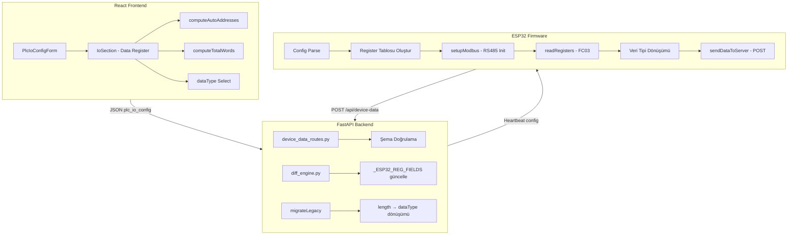

# Tasarım Dokümanı: Modbus Veri Tipleri

## Genel Bakış

Bu tasarım, OFK-SCADA sistemine Modbus veri tipi desteği ekler. Üç ana katmanda değişiklik yapılır:

1. **Frontend (React)**: Data Register tablosunda `length` yerine `dataType` seçimi, otomatik adres hesaplama ve toplam word gösterimi
2. **Backend (FastAPI)**: Yeni JSON şeması desteği, geriye uyumluluk dönüşümü ve diff engine güncellemesi
3. **ESP32 Firmware (Arduino)**: Modbus RTU Master ile register okuma, veri tipi dönüşümü ve sunucuya gönderim

Temel tasarım prensibi: **hesaplanabilir durumu tekrarlamamak**. Adres ve PLC Tag gibi türetilebilir değerler frontend'de hesaplanır ve JSON'a sadece kaynak veri (`dataType`, başlangıç adresi) yazılır.

---

## Mimari



---

## Bileşenler ve Arayüzler

### 1. Frontend Bileşenleri

#### 1.1 Veri Tipi Sabitleri (`deviceCatalog.js`)

```javascript
export const DATA_TYPE_OPTIONS = [
  { value: 'W',    label: 'W',    desc: 'Word (uint16)',        wordSize: 1, range: '0 – 65535' },
  { value: 'INT',  label: 'INT',  desc: 'Integer (int16)',      wordSize: 1, range: '-32768 – 32767' },
  { value: 'DW',   label: 'DW',   desc: 'Double Word (uint32)', wordSize: 2, range: '0 – 4294967295' },
  { value: 'DINT', label: 'DINT', desc: 'Double Int (int32)',   wordSize: 2, range: '-2147483648 – 2147483647' },
  { value: 'FLT',  label: 'FLT',  desc: 'Float (IEEE-754)',     wordSize: 2, range: '±3.4×10³⁸' },
]
```

#### 1.2 `computeAutoAddresses(registers, startAddress)` (`plcIoUtils.js`)

Saf fonksiyon: register dizisi ve başlangıç adresinden tüm satırların `registerAddress` ve `plcTag` değerlerini hesaplar.

```javascript
/**
 * @param {Array} registers - [{dataType, tagName, description, ...}, ...]
 * @param {number} startAddress - İlk satırın register adresi (default: 4096)
 * @returns {Array} - Hesaplanmış registerAddress ve plcTag ile zenginleştirilmiş dizi
 */
export function computeAutoAddresses(registers, startAddress = 4096) {
  let currentAddr = startAddress
  return registers.map((reg) => {
    const wordSize = getWordSize(reg.dataType || 'W')
    const result = {
      ...reg,
      registerAddress: currentAddr,
      plcTag: `D${currentAddr - 4096}`,
    }
    currentAddr += wordSize
    return result
  })
}

export function getWordSize(dataType) {
  return ['DW', 'DINT', 'FLT'].includes(dataType) ? 2 : 1
}

export function computeTotalWords(registers) {
  return registers.reduce((sum, reg) => sum + getWordSize(reg.dataType || 'W'), 0)
}
```

#### 1.3 `clampValue(value, min, max)` (`plcIoUtils.js`)

```javascript
export function clampValue(value, min, max) {
  if (value < min) return min
  if (value > max) return max
  return value
}
```

#### 1.4 Güncellenen REGISTER_COLUMNS (`PlcIoConfigForm.jsx`)

```javascript
const REGISTER_COLUMNS = [
  { key: 'plcTag',          label: 'PLC Tag',     type: 'text',   readOnly: true },
  { key: 'registerAddress', label: 'Reg. Adresi', type: 'number', readOnly: (rowIdx) => rowIdx > 0 },
  { key: 'dataType',        label: 'Veri Tipi',   type: 'select', options: DATA_TYPE_OPTIONS },
  { key: 'tagName',         label: 'Tag İsmi',    type: 'text' },
  { key: 'description',     label: 'Açıklama',    type: 'text' },
]
```

#### 1.5 `IoSection` Bileşen Güncellemeleri

- `type: 'select'` desteği eklenir (açılır liste render)
- `readOnly` prop desteği eklenir (satır bazında)
- Toplam word badge: `computeTotalWords()` sonucu bölüm başlığında gösterilir
- İlk satır `registerAddress` değiştiğinde tüm satırlar `computeAutoAddresses()` ile güncellenir
- Herhangi bir satırın `dataType` değeri değiştiğinde tüm aşağı satırlar güncellenir

#### 1.6 Geriye Uyumluluk Dönüştürücü (`plcIoUtils.js`)

```javascript
export function migrateLegacyRegisters(registers) {
  return registers.map((reg) => {
    if (reg.length !== undefined && reg.dataType === undefined) {
      const dataType = reg.length >= 2 ? 'DW' : 'W'
      const { length, ...rest } = reg
      return { ...rest, dataType }
    }
    return reg
  })
}
```

### 2. Backend Bileşenleri

#### 2.1 diff_engine.py Güncellemesi

```python
_ESP32_REG_FIELDS = {"plcTag", "registerAddress", "dataType"}
```

`length` alanı kaldırılır, `dataType` eklenir. Bu değişiklik ESP32'ye gönderilen config payload'unu etkiler.

#### 2.2 modbus_config Genişletme

`modbus_config` JSON nesnesine eklenen yeni alanlar:

```python
# Varsayılan değerler
DEFAULT_MODBUS_TIMING = {
    "readInterval": 1000,  # ms
    "timeout": 500,        # ms
    "retryCount": 2,
}
```

Backend, bu alanları mevcut `modbus_config` ile birleştirir ve ESP32'ye heartbeat yanıtında gönderir.

#### 2.3 Geriye Uyumluluk

`build_full_config_payload` fonksiyonunda:
- `dataRegisters` içinde `length` varsa ve `dataType` yoksa → otomatik dönüşüm
- Dönüşüm kuralı: `length=1 → "W"`, `length=2 → "DW"`

### 3. ESP32 Firmware Bileşenleri

#### 3.1 Modbus RTU Kütüphane Seçimi

`emeliart/modbus-esp8266` (ModbusRTU) kütüphanesi kullanılır. Arduino platformu için yerleşik RS485 DE/RE pin desteği vardır.

#### 3.2 Pin Konfigürasyonu

| Pin | İşlev |
|-----|-------|
| GPIO16 | RS485 RX |
| GPIO17 | RS485 TX |
| GPIO4 | DE/RE (Direction Enable) |

#### 3.3 Veri Yapıları

```cpp
// Veri tipi enum
enum DataType { DT_W, DT_INT, DT_DW, DT_DINT, DT_FLT };

// Tek register satır tanımı
struct RegisterEntry {
  uint16_t address;     // Modbus register adresi
  DataType dataType;    // Veri tipi
  char     plcTag[8];   // "D0", "D2", vb.
};

// Register tablosu
struct RegisterTable {
  RegisterEntry entries[64];  // Max 64 register
  uint8_t       count;
  uint16_t      totalWords;   // Toplam okunacak word sayısı
  uint16_t      startAddr;    // İlk register adresi
};
```

#### 3.4 `setupModbus()`

```cpp
void setupModbus() {
  Serial2.begin(g_baudRate, SERIAL_8N1, RX_PIN, TX_PIN);
  mb.begin(&Serial2, DE_RE_PIN);
  mb.master();
}
```

#### 3.5 `readRegisters()` — Toplu FC03 Okuma

Ardışık register adreslerini tek bir FC03 isteği ile okur:

```cpp
bool readRegisters(uint16_t* buffer, uint16_t startAddr, uint16_t count) {
  // FC03: Read Holding Registers
  // slaveId, startAddr, count, buffer
  if (!mb.readHreg(g_slaveId, startAddr, buffer, count, cbTransaction)) {
    return false;
  }
  // Yanıt bekleme (timeout + retry)
  unsigned long start = millis();
  while (mb.slave()) {
    mb.task();
    if (millis() - start > g_timeout) return false;
    delay(1);
  }
  return true;
}
```

#### 3.6 Veri Tipi Dönüşümü — Delta DVP Byte Sırası

Delta DVP, 32-bit veriler için **LOW WORD önce** (register N = LOW, register N+1 = HIGH) düzeni kullanır.

```cpp
// 32-bit unsigned (DW)
uint32_t parseDW(uint16_t* regs) {
  return ((uint32_t)regs[1] << 16) | (uint32_t)regs[0];
}

// 32-bit signed (DINT)
int32_t parseDINT(uint16_t* regs) {
  uint32_t raw = ((uint32_t)regs[1] << 16) | (uint32_t)regs[0];
  return (int32_t)raw;
}

// Float (FLT) — IEEE-754
float parseFLT(uint16_t* regs) {
  uint32_t raw = ((uint32_t)regs[1] << 16) | (uint32_t)regs[0];
  float result;
  memcpy(&result, &raw, sizeof(float));
  return result;
}
```

#### 3.7 `sendDataToServer()` — JSON Payload

```cpp
void sendDataToServer() {
  if (g_deviceStatus == "offline") return;
  
  JsonDocument doc;
  doc["deviceId"]  = g_deviceId;
  doc["timestamp"] = getISOTimestamp();
  doc["type"]      = "plc";
  doc["subtype"]   = "dvp_ss2";
  
  JsonObject data = doc["data"].to<JsonObject>();
  JsonObject regs = data["dataRegisters"].to<JsonObject>();
  
  for (int i = 0; i < g_regTable.count; i++) {
    RegisterEntry& entry = g_regTable.entries[i];
    switch (entry.dataType) {
      case DT_W:    regs[entry.plcTag] = g_values_u16[i]; break;
      case DT_INT:  regs[entry.plcTag] = g_values_i16[i]; break;
      case DT_DW:   regs[entry.plcTag] = g_values_u32[i]; break;
      case DT_DINT: regs[entry.plcTag] = g_values_i32[i]; break;
      case DT_FLT:  regs[entry.plcTag] = g_values_flt[i]; break;
    }
  }
  
  // HTTP POST
  HTTPClient http;
  http.begin(g_serverUrl + "/api/device-data");
  http.addHeader("Content-Type", "application/json");
  String body;
  serializeJson(doc, body);
  int code = http.POST(body);
  
  if (code != 200) {
    Serial.printf("[Data] HTTP %d - hata!\n", code);
  }
  http.end();
}
```

#### 3.8 Config Parse

Heartbeat yanıtından gelen `plc_io_config.dataRegisters` dizisi parse edilir:

```cpp
void parseDataRegisters(JsonArray arr) {
  g_regTable.count = 0;
  g_regTable.totalWords = 0;
  
  for (JsonObject obj : arr) {
    if (g_regTable.count >= 64) break;
    
    RegisterEntry& entry = g_regTable.entries[g_regTable.count];
    entry.address = obj["registerAddress"] | 0;
    strncpy(entry.plcTag, obj["plcTag"] | "", 7);
    
    const char* dt = obj["dataType"] | "W";
    if      (strcmp(dt, "W") == 0)    entry.dataType = DT_W;
    else if (strcmp(dt, "INT") == 0)  entry.dataType = DT_INT;
    else if (strcmp(dt, "DW") == 0)   entry.dataType = DT_DW;
    else if (strcmp(dt, "DINT") == 0) entry.dataType = DT_DINT;
    else if (strcmp(dt, "FLT") == 0)  entry.dataType = DT_FLT;
    else                              entry.dataType = DT_W;
    
    uint8_t ws = (entry.dataType >= DT_DW) ? 2 : 1;
    g_regTable.totalWords += ws;
    g_regTable.count++;
  }
  
  if (g_regTable.count > 0) {
    g_regTable.startAddr = g_regTable.entries[0].address;
  }
}
```

---

## Veri Modelleri

### JSON Şemaları

#### plc_io_config (Yeni Format)

```json
{
  "coils": [
    { "plcTag": "M0", "coilAddress": 2048, "tagName": "Motor1", "description": "..." }
  ],
  "dataRegisters": [
    { "plcTag": "D0", "registerAddress": 4096, "dataType": "W", "tagName": "Sicaklik", "description": "..." },
    { "plcTag": "D1", "registerAddress": 4097, "dataType": "INT", "tagName": "Basinc", "description": "..." },
    { "plcTag": "D2", "registerAddress": 4098, "dataType": "DW", "tagName": "Sayac", "description": "..." },
    { "plcTag": "D4", "registerAddress": 4100, "dataType": "FLT", "tagName": "Akis", "description": "..." }
  ]
}
```

#### modbus_config (Genişletilmiş)

```json
{
  "slaveId": 1,
  "baudRate": 9600,
  "dataBits": 8,
  "stopBits": 1,
  "parity": "none",
  "readInterval": 1000,
  "timeout": 500,
  "retryCount": 2
}
```

#### ESP32 → Backend Veri Payload

```json
{
  "deviceId": "abc-123",
  "timestamp": "2025-01-15T14:30:00.000",
  "type": "plc",
  "subtype": "dvp_ss2",
  "data": {
    "dataRegisters": {
      "D0": 28500,
      "D1": -150,
      "D2": 75823,
      "D4": 45.67
    }
  }
}
```

#### Eski Format (Geriye Uyumluluk)

```json
{
  "dataRegisters": [
    { "plcTag": "D0", "registerAddress": 4096, "length": 1, "tagName": "...", "description": "..." }
  ]
}
```

Dönüşüm: `length=1 → dataType:"W"`, `length=2 → dataType:"DW"`

---

## Doğruluk Özellikleri (Correctness Properties)

*Bir özellik (property), sistemin tüm geçerli çalışmalarında doğru kalması gereken bir karakteristik veya davranıştır — esasen, sistemin ne yapması gerektiğine ilişkin formal bir ifadedir. Özellikler, insan tarafından okunabilir spesifikasyonlar ile makine tarafından doğrulanabilir doğruluk garantileri arasındaki köprüyü oluşturur.*

### Property 1: Adres Hesaplama Tutarlılığı

*Herhangi bir* data register dizisi ve geçerli başlangıç adresi için, `address[i] = startAddress + Σ(wordSize(dataType[j]) for j in 0..i-1)` eşitliği her zaman geçerlidir. Yani her satırın register adresi, önceki tüm satırların word boyutlarının toplamı ile başlangıç adresinin toplamına eşittir.

**Doğrular: Gereksinim 2.2, 2.3, 2.4**

### Property 2: PLC Tag Otomatik Üretimi

*Herhangi bir* geçerli register adresi `A` ve baz adres 4096 için, üretilen PLC Tag değeri her zaman `"D" + (A - 4096)` formülüne eşittir.

**Doğrular: Gereksinim 2.5**

### Property 3: Adres Çakışmasızlık Değişmezi

*Herhangi bir* register konfigürasyonu için, 2 word'lük veri tipine (DW, DINT, FLT) sahip bir satırın adresi `A` ise, `A+1` adresi başka hiçbir satıra atanmamıştır. Başka bir deyişle, hesaplanan adres dizisinde hiçbir adres birden fazla satır tarafından kullanılmaz.

**Doğrular: Gereksinim 3.1**

### Property 4: Toplam Word Sayısı Doğruluğu

*Herhangi bir* register konfigürasyonu için, toplam word sayısı her zaman tüm satırların `wordSize(dataType)` değerlerinin toplamına eşittir: `totalWords = Σ(wordSize(row.dataType) for each row)`.

**Doğrular: Gereksinim 3.3**

### Property 5: Değer Sınırlama (Clamping)

*Herhangi bir* sayısal giriş `V` ve tanımlı aralık `[min, max]` için, `clampValue(V, min, max)` sonucu her zaman `min ≤ sonuç ≤ max` koşulunu sağlar. Ayrıca `min ≤ V ≤ max` ise sonuç `V`'ye eşittir.

**Doğrular: Gereksinim 4.4**

### Property 6: dataType → Word Boyutu Eşlemesi

*Herhangi bir* geçerli `dataType` değeri için, `getWordSize` fonksiyonu deterministik sonuç verir: W/INT → 1, DW/DINT/FLT → 2. Eşleme tüm geçerli girişler için total ve tutarlıdır.

**Doğrular: Gereksinim 5.5**

### Property 7: Delta DVP 32-bit Geri Dönüşüm

*Herhangi bir* 32-bit değer için, bu değeri LOW WORD (alt 16 bit) ve HIGH WORD (üst 16 bit) olarak ayırıp Delta DVP sırasıyla (regs[0]=LOW, regs[1]=HIGH) yeniden birleştirdiğimizde orijinal değeri elde ederiz. Yani `reassemble(split(value)) == value` her zaman geçerlidir.

**Doğrular: Gereksinim 6.5**

### Property 8: Veri Tipi Dönüşüm Doğruluğu

*Herhangi bir* geçerli byte patterni ve dataType kombinasyonu için, C tipi dönüşüm doğru yorumlama üretir: W→uint16_t değer aralığı [0, 65535], INT→int16_t aralığı [-32768, 32767], DW→uint32_t aralığı [0, 2³²-1], DINT→int32_t aralığı [-2³¹, 2³¹-1], FLT→IEEE-754 float.

**Doğrular: Gereksinim 6.4**

### Property 9: Geriye Uyumluluk Dönüşümü

*Herhangi bir* eski format register kaydı için, `migrateLegacyRegisters` fonksiyonu deterministik dönüşüm üretir: `length=1 → dataType="W"`, `length=2 → dataType="DW"`. Zaten `dataType` alanına sahip kayıtlar değiştirilmez.

**Doğrular: Gereksinim 8.2**

### Property 10: Veri Gönderim Payload Bütünlüğü

*Herhangi bir* N kayıtlı register tablosu için, oluşturulan JSON payload'daki `data.dataRegisters` nesnesi tam olarak N adet anahtar-değer çifti içerir; her anahtarı bir PLC Tag'e ve her değeri o register'ın dönüştürülmüş değerine eşittir.

**Doğrular: Gereksinim 7.3**

---

## Hata Yönetimi

### Frontend

| Durum | Davranış |
|-------|----------|
| Geçersiz dataType değeri | Varsayılana ("W") geri dönülür |
| Aralık dışı Modbus parametresi | `clampValue` ile en yakın sınıra çekilir |
| Eski format veri yükleme | `migrateLegacyRegisters` ile otomatik dönüşüm |
| Boş register listesi | Toplam word = 0, badge gösterilmez |

### Backend

| Durum | Davranış |
|-------|----------|
| `dataType` eksik, `length` var | Otomatik dönüşüm (1→W, 2→DW) |
| `dataType` ve `length` ikisi de yok | Varsayılan "W" atanır |
| Geçersiz `dataType` değeri | HTTP 400 döner |
| `modbus_config` timing alanları eksik | Varsayılan değerler kullanılır |

### ESP32 Firmware

| Durum | Davranış |
|-------|----------|
| Modbus timeout | Yapılandırılan retry kadar tekrar dener |
| Tüm retry başarısız | Hata loglanır, sonraki periyoda geçilir |
| HTTP POST başarısız | Hata loglanır, sonraki periyotta tekrar denenir |
| `g_deviceStatus == "offline"` | Okuma ve gönderim yapılmaz |
| Bilinmeyen dataType | `DT_W` varsayılır |
| Register sayısı > 64 | İlk 64 ile sınırlandırılır |
| Config parse hatası | Eski tablo korunur |

---

## Test Stratejisi

### Test Türleri

| Tür | Kapsam | Araç |
|-----|--------|------|
| **Property-based** | Saf fonksiyonlar (adres hesaplama, dönüşümler, clamping) | Vitest + fast-check |
| **Unit test** | Spesifik örnekler ve kenar durumları | Vitest |
| **Integration test** | Backend endpoint, diff engine | pytest |
| **Smoke test** | UI bileşen render kontrolü | Vitest + React Testing Library |

### Property-Based Test Konfigürasyonu

- **Kütüphane**: `fast-check` (JavaScript/TypeScript property-based testing)
- **Minimum iterasyon**: 100 per property
- **Tag formatı**: `Feature: modbus-data-types, Property N: [açıklama]`

### Hedef Dosyalar

| Property | Test Dosyası |
|----------|--------------|
| Property 1-4 (Adres hesaplama) | `src/features/device/__tests__/plcIoUtils.property.test.js` |
| Property 5 (Clamping) | `src/features/device/__tests__/plcIoUtils.property.test.js` |
| Property 6 (WordSize eşleme) | `src/features/device/__tests__/plcIoUtils.property.test.js` |
| Property 7-8 (32-bit dönüşüm) | `firmware/esp32_scada/test/modbus_convert.property.test.js` |
| Property 9 (Legacy dönüşüm) | `src/features/device/__tests__/plcIoUtils.property.test.js` |
| Property 10 (Payload) | `firmware/esp32_scada/test/payload.property.test.js` |

### Unit Test Kapsamı

- `computeAutoAddresses`: Spesifik örnekler (boş dizi, tek satır, karışık tipler)
- `migrateLegacyRegisters`: length=1, length=2, zaten dataType var
- `clampValue`: Sınırda değerler, tam ortada değerler
- `getWordSize`: Tüm geçerli tipler + bilinmeyen tip
- Backend diff_engine: `_ESP32_REG_FIELDS` güncellemesi doğrulaması

### Integration Test Kapsamı

- ESP32 config parse ile gerçek JSON payload
- Backend `POST /api/device-data` ile yeni format veri
- Diff engine ile eski→yeni geçiş senaryoları
