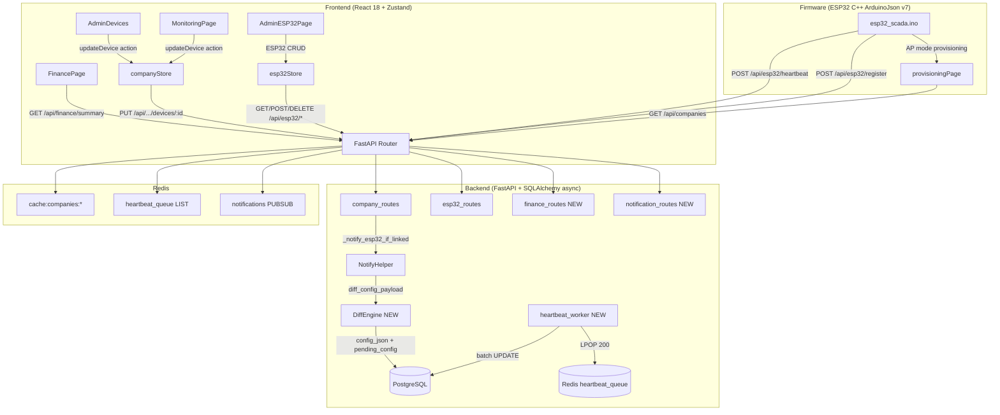

# Tasarım Belgesi — OFK-SCADA v2

## Genel Bakış

OFK-SCADA v2 yükseltmesi, mevcut React 18 + FastAPI + PostgreSQL + Redis + Zustand mimarisini bozmadan 7 grup 16 özellik ekler. Değişiklikler bağımsız modüller/dosyalar olarak eklenir; mevcut auth, dashboard, firma, lokasyon, kullanıcı ve yetkilendirme katmanları dokunulmadan kalır.

Temel tasarım ilkeleri:

- **Tek Kaynak (Single Source of Truth):** `Device.plc_io_config` tüm tag/coil/register bilgisinin tek sahibidir.
- **MAC Kimliği:** Her ESP32, MAC adresine göre kimlik kazanır; IP çakışması sorun değildir.
- **Diff-First İletişim:** İlk bağlantı tam config, sonraki güncellemeler yalnızca değişen alanlar.
- **Ölçeklenebilir Kuyruk:** Heartbeat ve veri istekleri Redis queue üzerinden batch işlenir.
- **Mevcut Altyapıyı Koru:** `_notify_esp32_if_linked` mekanizması genişletilir, değiştirilmez.

---

## Mimari



---

## Bileşenler ve Arayüzler

### 1. Backend — DiffEngine (`backend/app/diff_engine.py`)

Yeni bağımsız modül. `plc_io_config` karşılaştırması ve diff payload üretimi.

```python
def compute_config_diff(old_config: dict, new_config: dict) -> dict | None:
    """
    İki plc_io_config arasındaki farkı hesaplar.
    Değişen alan yoksa None döner.
    Değişen varsa {"diff": True, "changed": {...}} döner.
    """

def build_full_config_payload(device: Device, company_name: str, location_name: str) -> dict:
    """İlk kayıt veya force_full için tam yapılandırma paketi üretir."""

def build_diff_config_payload(device: Device, old_plc_io: dict) -> dict | None:
    """Sonraki değişiklikler için diff paketi üretir. Değişen yoksa None."""
```

### 2. Backend — HeartbeatWorker (`backend/app/heartbeat_worker.py`)

Mevcut `batch_worker.py` örneğini izleyerek bağımsız async worker.

```python
async def enqueue_heartbeat(body: dict) -> None:
    """Heartbeat isteğini Redis kuyruğuna ekler."""

async def flush_heartbeat_queue(batch_size: int = 200) -> int:
    """Kuyruktan toplu alır, tek SQL UPDATE ile yazar."""

async def heartbeat_worker_loop() -> None:
    """Sürekli çalışan döngü, 1 saniyede bir flush."""
```

### 3. Backend — FinanceRoutes (`backend/app/routes/finance_routes.py`)

Yeni route modülü.

```
GET /api/finance/summary
→ Firma bazlı aktif cihaz listesi, birim fiyatlar, lokasyon toplamları, genel toplam
```

### 4. Backend — NotificationRoutes / Helper

Mevcut `ws_manager.py` altyapısını kullanarak pasif cihaz bildirimi yayınlar.

```
POST /api/devices/{id}/notify-passive
→ Redis pub/sub "notifications" kanalında yayın
WebSocket /ws/notifications → firma_id bazlı filtreleme
```

### 5. Frontend — `companyStore` Genişletmesi

`src/features/company/companyStore.js` mevcut `updateDevice` action'ı aşağıdaki mantıkla güçlendirilir:

```
updateDevice(companyId, locationId, deviceId, formData)
  → PUT /api/companies/{cid}/locations/{lid}/devices/{id}
  → store'da ilgili device'ı güncelle
  → Abonelik ile tüm bileşenler otomatik yenilenir
```

### 6. Frontend — `esp32Store` Genişletmesi

`src/features/esp32/esp32Store.js`'e eklenen action'lar:

```javascript
deleteEsp32(esp32Id)          // DELETE /api/esp32/:id
updateEsp32Tag(esp32Id, tag)  // PATCH  /api/esp32/:id/tag
```

### 7. Firmware — Provisioning Genişletmesi

`esp32_scada.ino` provisioning sayfasına firma/lokasyon dropdown eklenir. Yeni C++ yardımcı fonksiyonlar:

```cpp
String fetchCompaniesJson();          // GET /api/companies → JSON
String buildCompanyOptions(String json);  // <option> listesi
String buildLocationOptions(int companyId, String json);
```

### 8. Frontend — `AdminDevices` Düzenleme

`src/pages/Admin/AdminDevices.jsx`'e "Düzenle" butonu ve modal eklenir. Mevcut `AdminCompanyDetail.jsx`'teki düzenleme formunun birebir kopyası (form kodu ortak bileşene `DeviceEditModal` olarak çıkarılır).

### 9. Frontend — İzleme Sayfası Satır İçi Düzenleme

Mevcut `I/O Yapılandırmasını Düzenle` butonu kaldırılır. `InlineEditCell` bileşeni eklenir:

```jsx
<InlineEditCell
  value={tag.tagName}
  editable={true}
  onSave={(v) => handleCellSave('tagName', idx, v)}
/>
```

Admin rolünde ek `coil` ve `plcTag` hücreleri de `InlineEditCell` ile sarılır.

### 10. Frontend — `FinancePage`

`src/pages/Admin/FinancePage.jsx` yeni bileşen. Admin menüsüne eklenir.

---

## Veri Modelleri

### `Device` model değişiklikleri

```python
# Yeni alan
unit_price = Column(Numeric(10, 2), default=0, nullable=False)
```

### `ESP32Device` model değişiklikleri

```python
# Yeni alanlar
company_id = Column(Integer, ForeignKey("companies.id", ondelete="SET NULL"), nullable=True)
location_id = Column(Integer, ForeignKey("locations.id", ondelete="SET NULL"), nullable=True)
conflict    = Column(Boolean, default=False)   # aynı MAC farklı tag çakışması
```

### `ESP32RegisterRequest` schema değişiklikleri

```python
company_id  : Optional[int] = None
location_id : Optional[int] = None
```

### `DeviceUpdateSchema` değişiklikleri

```python
unit_price : Optional[float] = None
```

### Diff Payload Formatı (JSON şeması)

**Tam Config (full):**
```json
{
  "diff": false,
  "device_id": "DEV-001",
  "device_type": "plc",
  "company_name": "Örnek Firma",
  "location_name": "İzmir Tesisi",
  "modbus_config": { "slaveId": 1, "baudRate": 9600, "dataBits": 8, "stopBits": 1, "parity": "none" },
  "plc_io_config": {
    "coils": [{ "address": 0, "tagName": "Motor 1", "plcTag": "Y0" }],
    "dataRegisters": [{ "address": 100, "tagName": "Sıcaklık", "plcTag": "D0" }]
  },
  "device_status": "online"
}
```

**Diff Config:**
```json
{
  "diff": true,
  "device_id": "DEV-001",
  "changed": {
    "coils": [{ "address": 0, "tagName": "Motor 1 GÜNCEL", "plcTag": "Y0" }]
  }
}
```

### Heartbeat Kuyruk Kaydı (Redis LIST item)

```json
{
  "esp32_id": 42,
  "ip_address": "192.168.1.50",
  "firmware_version": "1.4.0",
  "config_ack": false,
  "received_at": "2025-01-15T10:23:45.123456"
}
```

### Finance Summary Yanıtı

```json
{
  "companies": [
    {
      "id": 1,
      "name": "Örnek Firma",
      "locations": [
        {
          "id": 10,
          "name": "İzmir Tesisi",
          "devices": [
            { "id": "DEV-001", "tagName": "Kazan", "unit_price": 250.0, "status": "online" }
          ],
          "subtotal": 250.0
        }
      ],
      "total": 250.0,
      "active_device_count": 1
    }
  ],
  "grand_total": 250.0,
  "generated_at": "2025-01-15T10:00:00"
}
```

---

## Correctness Properties

*Property, sistemin tüm geçerli çalışmalarında doğru tutması gereken evrensel bir davranış özelliğidir. Özellikler, insan tarafından okunabilir spesifikasyonlar ile makine doğrulanabilir doğruluk garantileri arasında köprü görevi görür.*

### Property 1: URL Dönüşüm Tutarlılığı

*Herhangi bir* geçerli sunucu URL'si için, `transform_server_url(url)` fonksiyonu şu invariantı korur: sonuç ya orijinal URL'ye eşittir (yerel IP durumunda) ya da `https://` ile başlar (genel URL durumunda). Fonksiyon asla boş string veya geçersiz prefix döndürmez.

**Doğrular: Gereksinim 1.3, 1.4**

---

### Property 2: Store Senkronizasyonu — İzdeşlik (Idempotence)

*Herhangi bir* cihaz güncellemesi için, `updateDevice(companyId, locationId, deviceId, payload)` action'ı ardı ardına iki kez aynı payload ile çağrıldığında store state'i birinci çağrı sonrasıyla birebir aynı olur. Store, tekrarlayan güncellemelere karşı kararlı bir durumda kalır.

**Doğrular: Gereksinim 3.4, 4.3, 4.4**

---

### Property 3: Diff Kapsam Invariantı

*Herhangi bir* eski `plc_io_config` ve yeni `plc_io_config` çifti için, `compute_config_diff(old, new)` fonksiyonu şu invariantı korur: diff içindeki her anahtar yeni config'de mevcuttur ve eski config'den farklıdır. Eski ile aynı kalan hiçbir alan diff içinde yer almaz. Değişen alan yoksa `None` döner.

**Doğrular: Gereksinim 11.1, 11.2, 11.3, 16.1, 16.2**

---

### Property 4: Diff Uygulama Round-Trip

*Herhangi bir* geçerli tam config `C` ve diff payload `D = compute_config_diff(C, C')` için, `apply_diff(C, D)` işlemi `C'`'ye eşdeğer bir config üretir. Başka bir deyişle: `apply_diff(C, compute_config_diff(C, C')) ≡ C'`.

**Doğrular: Gereksinim 16.4, 16.5**

---

### Property 5: Finans Toplam Hesabı Invariantı

*Herhangi bir* Device listesi için, `/api/finance/summary` yanıtında şu invariant korunur: (1) yalnızca `status = "online"` olan cihazlar toplamda yer alır; (2) lokasyon alt toplamı, o lokasyondaki aktif cihazların `unit_price` değerlerinin aritmetik toplamına eşittir; (3) firma toplamı, o firmadaki tüm lokasyon alt toplamlarının toplamına eşittir; (4) genel toplam tüm firma toplamlarının toplamıdır.

**Doğrular: Gereksinim 14.3, 14.4, 14.5**

---

### Property 6: Heartbeat Kuyruk Kaybı Yok

*Herhangi bir* N adet heartbeat isteği için, `enqueue_heartbeat` N kez çağrıldıktan sonra Redis kuyruğunun uzunluğu en az N artar. Ardından `flush_heartbeat_queue` çağrıları tamamlandıktan sonra kuyruktan çıkarılan toplam kayıt sayısı N'e eşittir. Kuyruktan kayıp olmaz.

**Doğrular: Gereksinim 15.1, 15.2, 15.3**

---

## Hata Yönetimi

### ESP32 Bağlantı Hataları

| Durum | Backend Davranışı | Firmware Davranışı |
|---|---|---|
| Register 307 redirect | `setFollowRedirects` ile otomatik takip | `HTTPC_STRICT_FOLLOW_REDIRECTS` |
| Register 404 | — | ID sıfırla, yeniden kayıt |
| Heartbeat Redis hatası | Fallback: doğrudan DB yaz | Hata sayacı artır, AP moduna geçme |
| Config ACK gelmedi | `pending_config = true` kalır, bir sonraki heartbeat'te yeniden dene | — |

### Diff Hesaplama Hataları

- `old_config` veya `new_config` `None` ise: `build_full_config_payload` çağrılır.
- JSON deserializasyon hatası: full config gönderilir, hata loglanır.
- Kısmi diff uygulamasında hata: ESP32 konfigürasyonu değiştirmez, bir sonraki heartbeat'te yeniden dener.

### Finans Hesaplama

- `unit_price = None` olan cihazlar `0` olarak kabul edilir.
- Firma veya lokasyon silinmişse o satır özetten düşülür; hata fırlatılmaz.

### Pasif Cihaz Bildirimi

- WebSocket bağlantısı yoksa: bildirim Redis pub/sub'da kalır, yeniden bağlanınca frontend'e iletilir.
- Kullanıcı uyarıyı kapatırsa: session boyunca gizlenir; cihaz tekrar aktife alınana kadar yeniden gösterilmez.

---

## Test Stratejisi

### Birim Testler (Python `pytest`)

- `test_diff_engine.py`: `compute_config_diff` ve `apply_diff` fonksiyonları için
- `test_finance_routes.py`: toplam hesaplama mantığı için
- `test_heartbeat_worker.py`: `enqueue_heartbeat` ve `flush_heartbeat_queue` için

### Property Tabanlı Testler (Python `hypothesis`)

Her property için minimum 100 iterasyon. Her test, yukarıdaki Correctness Properties bölümüne referans verir.

Tag formatı: `**Feature: scada-v2, Property {N}: {property_text}**`

- **Property 1** → `@given(url=url_strategy())` ile URL dönüşüm invariantı testi
- **Property 2** → `@given(device=device_strategy(), payload=payload_strategy())` ile store idempotence testi
- **Property 3** → `@given(old=plc_io_strategy(), new=plc_io_strategy())` ile diff kapsam testi
- **Property 4** → `@given(config=plc_io_strategy())` ile diff round-trip testi
- **Property 5** → `@given(devices=device_list_strategy())` ile finans toplam invariant testi
- **Property 6** → `@given(n=integers(min_value=1, max_value=500))` ile kuyruk kayıp yok testi

### Entegrasyon Testler

- ESP32 register → link → heartbeat akışı (mock HTTP ile)
- Cihaz pasife alma → bildirim yayını → kullanıcı uyarı (mock WebSocket ile)
- Finans özeti endpoint'i (test DB ile)

### Frontend Testler (Vitest + React Testing Library)

- `AdminDevices`: Düzenleme butonunun görünümü ve modal açılması
- `InlineEditCell`: tıklama → input → blur → save event akışı
- `FinancePage`: aktif/pasif cihaz filtreleme render testi

### Firmware Testler

Firmware C++ birim testi mevcut toolchain ile desteklenmediğinden URL dönüşüm mantığı Python'a taşınan `transform_server_url` fonksiyonu üzerinden test edilir (Property 1).
